大数据与云计算

[目录](./README.md)

## 第一章-大数据概述

### 1.1 大数据时代--2010年前后
* 第三次信息化浪潮--大数据+云计算+物联网

### 1.1.1 第三次信息化浪潮
> 根据IBM前首席执行官 **郭士纳** 的观点,IT领域每隔 **15年** 就会迎来一次重大变革

| 信息化浪潮 | 发生时间   | 标志                 | 解决问题 | 代表企业                                     |
| ---        | ---        | ---                  | ---      | ---                                          |
| 第一次     | 1980年前后 | 个人计算机           | 信息处理 | Inter\AMD\IBM\Apple\Microsoft\Lenovo\Dell\Hp |
| 第二次     | 1995年前后 | 互联网               | 信息传输 | Yahoo\Google\Alipay\Baidu\Tencent            |
| 第三次     | 2010年前后 | 互联网\云计算\大数据 | 信息爆炸 | 将涌现一批新的市场标杆                       |

### 1.1.2 信息科技为大数据时代提供技术支持
* **存储**+**计算**+**网络**

1.1.4 大数据发展历程
| 阶段       | 时间                   | 内容                                                                                                                                                                                                                                                                                     |
| ---        | ---                    | ---                                                                                                                                                                                                                                                                                      |
| 萌芽期     | 上世纪90年代至本世纪初 | 随着 **数据挖掘理论和数据库技术** 的逐步成熟,一批商业智能工具和知识管理技术开始被应用,如数据仓库,专家系统,知识管理系统等.                                                                                                                        |
| 成熟期     | 本世纪前十年           | Web2.0应用迅猛发展,非结构化数据大量产生,传统处理方法难以应对,带动了大数据技术的快速突破,大数据解决方案逐渐走向成熟,形成了 **并行计算与分布式系统两大核心技术** ,谷歌的GFS和MapReduce等大数据技术搜到追捧, **Hadoop** 平台开始大行其道 |
| 大规模应用 | 2010年前后             | 大数据应用渗透各行各业,数据驱动决策,信息社会智能化程度大幅提高                                                                                                                                                                                                                           |

* **大数据发展的三个历程**
    * 运营式系统阶段
    * 用户原创内容阶段
    * 感知式系统阶段

### 1.2 大数据概念

* 4V1O
    * Volume     大量化
    * Velocity   快速化
    * Variety    多样化
    * Value      价值化
    * OneLine    线上化

> 大数据不仅仅是数据的"大量化",而是包含"快速化"."多样化"和"价值化"等多重属性

### 1.2.1 数据量大
> 根据IDC作出的估测,数据一直都在以每年 **50%**  的速度增长,也就是说明每两年就增长一倍(大数据摩尔定律)
> 人类在最近两年产生的数据量相当于之前产生的全部数据量.
> 预计2020年,全球将总共拥有35ZB,相较于2010年,数据量将增长30倍

==补充==
* 单位换算,标准进制1024,厂商进制1000
    - TB、PB、EB、ZB、YB、DB、NB

### 1.2.2 数据类型繁多
> 大数据是由 **结构化**  和 **非结构化**  组成的
>> - 10%的结构化数据,存储在数据库中
>> - 90%的非结构化数据,它们与人类信息有关-eg:基因组,Blog,图像

### 1.2.3 处理速度快
- [ ] 从数据的生成到消耗,时间窗口非常小,可用于生成决策的时间非常小
- [ ] 1秒定律:这一点也是和传统的数据挖掘技术有本质的不同

### 1.2.4 价值密度低,商业价值高

### 1.3 大数据的数据的影响
> 图灵奖获得者,著名数据库专家Jim Gray博士观察并总结人类自古以来,在科学研究上,先后经历
> **实验**  , **理论**  , **计算**  和 **数据**  四种模式
> 在思维方式方面,大数据完全颠覆了传统的思维方式:
>> **全样而非抽样**
>> **效率而非精确**
>> **相关而非因果**

### 1.4 大数据关键技术
* 大数据技术的层次
    * 数据存储管理
    * 数据处理与分析
> 大数据解决两大核心问题**分布式存储**,**分布式管理**
>> 代表公司: Google
>> * 分布式数据库 **Big Table**
>> * 分布式文件系统 **GFS**
>> * 分布式并行处理技术 **MapReduce**(批处理,不能满足实时性;实时性:Spark>MapReduce)

| 大数据计算模式 | 解决问题                       | 代表产品                                                                    |
| :---:          | ---                            | ---                                                                         |
| 批处理计算     | 针对大规模数据的批量处理       | MapReduce\Spark(迭代计算)\\...                                              |
| 流计算         | 针对流数据的实时计算机         | **Strom\S4\Flume**\Streams\Puma\DStream\Super Mario\银河流数据处理平台\\... |
| 图计算         | 针对大数据规模图结构数据的处理 | Pregel\GraphX\Giraph\PowerGraph\Hama\GoldenOrb\\...                         |
| 查询分析计算   | 大规模数据的存储管理和查询     | Dremel\Hive\Cassandra\Impala\\...                                           |

### 1.5.1 云计算
* 云计算典型特征: **虚拟化(核心)+多租户**
* 云计算概念:
> 云计算是通过**网络以服务的方式为用户提供非常*廉价*的IT资源**
* 云计算优势:
> 企业不需要自建IT基础设施,可以租用云端
* 云计算的三种模式+三种服务:
---

* 云计算关键技术
    1. **虚拟化**:
    
    > VPN:虚拟专用网,也是一种虚拟化技术
    2. **多租户**
    > 计算不是为单个用户服务,云计算同时为**多个用户服务**
    3. 分布式存储--数据存放于数据中心
    > 数据中心是云计算的温床,各种数据和应用,位于数据中心里

    ==扩展==

    * 数据中心包含大量刀片服务器
    * 数据中心建设在地址结构稳定的地方
    * 数据中心耗能巨大:
    
    4. 分布式计算

### 1.5.2 云计算典型应用
* 教务云,政务云,中小企业云,医疗云...

| 应用       | 功能                                                                                                                                           |
| ---        | ---                                                                                                                                            |
| 政务云     | 部署容灾备份,城市管理,智能交通,等应用;通过集约化建设,管理和政务资源共享,推动政务管理创新,加快向服务型政府转变                     |
| 教育云     | 可以有效整合幼儿教育,中小学教育,高等级教育及继续教育等优质教育资源,逐步实现教育信息共享,教育资源共享及教育资源深度挖掘等目标 |
| 中小企业云 | 让企业以低廉的成本家里财务,供应链,客户关系等管理应用系统,大大降低企业信息化门槛,迅速提升企业信息化水平,增强企业市场竞争力                 |
| 医疗云     | 推动医院与医院,医院与社区,与医院与急救中心,医院与家庭之间的服务共享,并形成有效地提高医疗保险的质量                            |

### 1.8.2 物联网IOT(International Of Things)
| 物联网架构 |
| :---:      |
| 感知层     |
| 网络层     |
| 处理层     |
| 应用层     |

### 1.8.3 大数据与云计算\物联网的关系
* **云计算** 解决分布式存储\计算
* **大数据** 处理分布式存储\计算
> * **大数据技术继承自云计算,**
> * **大数据时代为云计算提供用武之地,**
> * **物联网产生的数据存储于云计算,**
> * **数据又借助大数据进行分析**

