大数据与云计算

[目录](./README.md)

## 第二章-大数据处理架构Hadoop

### 1.1 Hadoop简介
* 创始人：Dog Cutting
    

* Hadoop是Apache软件基金会旗下的一个 **开源分布式计算平台**  为用户提供了系统底层细节透明的 **分布式基础架构**
> 2008年4月Hadoop用910个节点对1Tb数据进行排序仅用了209秒
* Hadoop基于Java开发, **跨平台**
* Hadoop的核心是分布式文件系统 **HDFS** ( Hadoop Distributed File System ) 和 **MapReduce**

> * MapReduce的作业主要包括
> - [ ] 从硬盘或网络 **读取数据** , 即**IO密集工作**
> - [ ]  **计算数据**             , 即**CPU密集工作**
> * HDFS来源于2003年Google的分布式文件系统GFS(Google File System)
>
> * MapReduce来源于2004年Google的分布式并行编程框架MapReduce
* Google\Yahoo\Cisco\Taobao 都支持 Hadoop

* 特征:
    - 高可靠性            : 多台机器构成集群，部分机器发生故障，剩余机器可以继续对外提供服务
    - 高效性              : 集群计算，并行处理
    - 高可扩展性          : 可以不断往集群中增加结点(机器)
    - 高可容错性          : 多副本机制
    - 成本低:对服务器要求低
    - 运行在 Linux 平台上
    - 支持多种编程语言    : eg C,C++,Java,SQL
---

---

### 2.2 Hadoop项目结构
---

| 组件      | 功能                                                                         |
| ---       | ---                                                                          |
| HDFS      | 分布式文件系统                                                               |
| MapReduce | 分布式并行编程模型(基于磁盘计算)                                             |
| YARN      | 资源管理和调度器                                                             |
| Tez       | 运行在YARN上的下一代Hadoop查询处理系(构建有向无关图，方便工作流程)           |
| Hive      | Hadoop上数据仓库(把SQL转换成MaReduce作业）                                   |
| HBase     | Hadoop上的非关系型的分布式数据库                                             |
| Sqoop     | 用于在Hadoop与传递数据库之间进行数据传递                                     |
| Oozie     | Hadoop上工作流管理系统                                                       |
| Zookeeper | 提供分布式协调一致性服务                                                     |
| Storm     | 流计算框架                                                                   |
| Flume     | 一个高可用的,高可靠的,分布式海量日志采集,聚合和传输的系统                    |
| Ambari    | Hadoop快捷部署工具,支持Apache Hadoop集群的供应,管理和监控                    |
| Kafka     | 一种高吞吐量的分布式发布订阅消息系统可以处理消费者规模网站中的所有动作流数据 |
| Spark     | 类似于Hadoop MapReduce的通用并行框架(基于内存计算,比MapReduce性能强)         |
| pig       | 一个基于Hadoop的大规模数据分析平台，提供类似SQL的查询语句Pig Latin(轻量级)   |

---

### 2.3 Hadoop的安装与使用
- [单机模式](http://dblab.xmu.edu.cn/blog/install-hadoop/?appId=1000) :默认模式为非分布式模式(本地模式),无需进行其它配置即可运行。非分布式即单Java进程,方便进行调试。

- [伪分布式](http://dblab.xmu.edu.cn/blog/2441-2/?appId=1000) :Hadoop可以在单节点上以伪分布式的方法运行,Hadoop进程以分离的Java进程来运行,节点即作为NameNode也作为DataNode,同时,读取的是HDFS中的文件。

- [分布式]() :使用多个节点构成集群环境来运行Hadoop。

### 2.4 Hadoop集群中有哪些重要节点类型

1. **NameNode** : 负责协调集群中的数据存储 ( 名称节点,存放数据地址,热备)
2. **DataNode** : 存储被拆分的数据块 ( 数据节点,存放具体数据).
3. **JobTracker** : 协调数据计算任务 ( 总管家)
4. **TaskTracker** : 负责执行JobTracker指派的任务
5. **SecondaryNameNode** : 帮助NameNode收集文件系统运行状态信息 ( 冷备,作用于加速启动)

### 2.5 Hadoop集群的整体性能取决于CPU,内存,网络及存储之间的 **性能平衡**
