大数据与云计算

[目录](./README.md)

## 分布式文件系统HDFS
### 3.1分布式文件系统简介

1. HDFS: Hadoop Distributed File System;
2. 大数据的两大核心技术: **分布式存储**、**分布式处理**
> 海量信息存储传统的单机无法存储,只能依托**集群分布式存储**

* 计算机集群基本架构
---

3. 文件系统结构
---

4. HDFS实现目标:
    * 兼容廉价的硬件设备
    * 实现流数据读写
    * 支持大数据集
    * 支持简单的文件类型
    * 强大的跨平台兼容性

5. HDFS自身的局限性:
    * 不适合低延迟的数据访问
    * 无法高效存储大量小文件
    * 不支持多用户写入及任意修改(只允许附加)

### 3.2HDFS相关概念
1. 块
    * 联系: 为了分摊磁盘读写开销也就是在大量数据间分摊磁盘寻址的开销
    * 区别: HDFS的一个块要比普通的文件系统的块大得多

==块==
* 普通文件系统默认64M(块的大小可自己定义)

> 为什么要这么设计?
>> * 支持面向大规模数据存储
>> * 降低分布式节点的寻址开销
>>> 缺点: 如果块过大会导致MapReduce就一两个任务在执行完全**牺牲了MapReduce的并行度**,发挥不了分布式并行处理的效果。

2. HDFS采用这种抽象的块的概念设计好处
* 支持大规模文件存储
* 简化系统设计
* 适合系统设计
* 适合数据备份

3. HDFS两大组件
---

<table>
    <tr>
        <th rowspan="5" align="center">元数据</th>
        <th>文件是什么</th>
    </tr>
    <tr>
        <td>文件被分成多少块</td>
    </tr>
    <tr>
        <td>每个块和文件是怎么映射的</td>
    </tr>
    <tr>
        <td>每个块存储在那个服务器上面</td>
    </tr>
</table>

> #### 元数据被定义为：描述数据的数据，对数据及信息资源的描述性信息。
>> 元数据(Metadata)是描述其它数据的数据(data about other data),或者说是用于提供某种资源的有关信息的结构数据(structured data)。
>>  * 元数据是描述信息资源或数据等对象的数据,
>>  *  其使用目的在于:
>>      * 识别资源;
>>      * 评价资源;
>>      * 追踪资源在使用过程中的变化;
>>      * 实现简单高效地管理大量网络化数据;
>>      * 实现信息资源的有效发现、查找、一体化组织和对使用资源的有效管理。
>>  * 元数据的基本特点主要有：
>>> * 元数据一经建立，便可共享。
>>> * 元数据的最为重要的特征和功能是为数字化信息资源建立一种机器可理解框架。

### 3.3.1名称节点(NameNode):

* **FsImage**: 保存系统文件树
    - 文件的复制级别
    - 修改和访问的时间
    - 访问权限
    - 块大小及组成文件的块
* **EditLog**: 记录对数据进行的诸如:创建、删除、重命名等操作
---

### 3.3.2第二名称节点(Secondary NameNode):
> 因为HDFS文件会逐渐地变大，不断变大的EditLog文件通常不会对系统文件产生影响，但是当EditLog很大时，使得在HDFS重启时，将EditLog合并到FsImage中的过程十分缓慢，系统长期处于“安全模式”，用户的使用受到影响。

1. Secondary NameNode的作用:
* 完成EditLog合并到FsImage的过程，缩短合并的重启时间，
* 其次作为“检查点”保存元数据的信息。
* 作为NameNode的"冷备"

---

> 如图，EditLog合并到FsImage中的过程:
> 1. 名称节点会生成新的EditLog.new来记录t2时刻以后的数据,
> 2. EditLog和FsImage会被拉到第二名称节点中,合并成为FsImage.ckpt,
> 在t1时刻替换名称节点中的FsImage。
> * 这样会出现一问题:
>> 如果是t2到t1时刻之间出现了问题,FsImage中的数据会丢失,所以说第二名称节点只是起到了“检查点”的作用而绝非“热备份”。

### 3.3数据节点(DataNode)
* HDFS**存、取**数据都将保存到linux文件系统
> * 数据节点负责数据的存储和相关具体操作,比如CRUD、搜索、聚合。
> * 所以,**数据节点对机器配置要求比较高**,
> * 首先需要有足够的磁盘空间来存储数据,其次数据操作对系统CPU、Memory和IO的性能消耗都很大。
> * 通常随着集群的扩大,需要增加更多的数据节点来提高可用性。**增加更多的数据节点来提高可用性。**
> * 数据节点负载重，设置专用的数据节点，避免因数据节点负载重导致主节点不响应。

### 3.4HDFS命名规则+空间访问协议
**目录+文件+块** == "/+目录名称" == 同Linux
---

---

### 3.5HDFS的**局限性**:

1. 命名空间限制 : 名称节点是保存在内存中的，因此，名称节点能够容纳的对象(文件、块)的个数会搜到空间大小的限制
2. 性能的瓶颈   : 真个分布式文件的吞吐量,受限于单个名称节点的吞吐量
3. 隔离问题     : 由于集群中只有一个名称节点，只有一个命名空间，因此无法对不同应用程序进行隔离
4. 集群的可用性 : 一旦这个唯一的名称节点发生故障，会导致整个集群变得不可用
