<CENTER style="font-size: 24px;font-weight: 700;">大数据与云计算</CENTER>

[目录](./00-目录.md)

## HBase
### 4.1HBase简介
#### 1. Big Tabel 诞生:

* 主要就是满足互联网搜索引擎的基本需求
* 用于网页搜索
* 用于谷歌非常多的项目里面，包括搜索、地图、财经、打印
* 还有一些社交网站 视频共享网站 博客网站等

#### 2. HBase 特点(可用于存储非结构化和板结构化的松散数据):

* **高可靠**
* **高性能**
* **面向列**
* **可伸缩**
    - 底层分布式文件系统 : 存储完全非结构化的数据
    - HBase              : 通过水平扩展,允许几千台服务器去存储海量文件

#### 3. HBase和Big Tabel的底层技术对应关系

|              | Big Tabel | HBase            |
| ---          | ---       | ---              |
| 文件存储系统 | GFS       | HDFS             |
| 海量数据处理 | MapReduce | Hadoop MapReduce |
| 协同管理服务 | Chubby    | ZooKeeper        |

> ### 为什么还要去设计 HBase 这么一个数据库产品?
>> * 虽然已经有了 HDFS 和 MapReduce, 但是 Hadoop 主要解决大规模数据离线批量处理 Hadoop 是没有办法满足大数据实时处理需求的,随着这些年数据的大规模爆炸式增长,传统关系型数据库的扩展能力非常有限
>> * 这样操作有两个缺陷,一个是不便利,另一个是效率非常低
> ### HBase 和传统的关系型数据库有什么联系和区别?
>> 1. 数据类型方面,传统的关系型数据库用的是非常经典的关系型数据模型
>> 2. 数据操作方面,在关系型数据库当中定了非常多的数据操作
>> 3. 存储模式方面,关系型数据是基于行模式存储,而对于 HBase 来讲是基于列存储
>> 4. 数据索引方面,关系数据库可以直接针对各个不同的列,构建非常复杂的索引
>>
>> | 关系型数据库 | 主索引+多二级索引      |
>> | :---:        | :---:                  |
>> | HBase        | 只支持对行键的简单索引 |
>>
>> 5. 数据维护方面,在关系数据库当中做一些更新操作的时候,实际上里面的值会被新的值覆盖掉
>> 6. 可伸缩性方面,关系数据库是很难实现水平扩展的，最多可以实现纵向扩展

#### 4. HBase访问接口:

4.4.1. 提供了一个原生 Java API:

* shell
* Thrift Gateway 方式
* REST Gateway

4.4.2. 提供 SQL 类型接口:

* Pig (大规模数据查询平台,提供类似 SQL 查询语句)
* Hive 数据仓库产品

### 4.2HBase数据模型

> ### HBase是一个稀疏的多维度的排序的映射表
> * 行键
> * 列族 : 支持动态扩展，保留旧的版本
> * 列限定符
> * 单元格 : 具体存储数据的地方
> * 时间戳 : 新的版本会通过时间戳来进行区分
>> 1. HBase 每一个值都是未经解释的字符串也就是 Bytes 数组
>> 2. 一个行可以有一个行键和任意多个列
>> 3. 列族是 HBase 当中一个非常核心的概念

#### 数据坐标的概念

1. 传统的关系数据库的定位

    * 只通过一个行一个列这两个维度就可确定一个唯一数据(Excel 表格就类似于关系数据库)

2. HBase 对数据的定位

    * 采用思维坐标来定位
    * 必须确定**行键**、**列族**、**列限定符**、**时间戳**
	* 键值数据

3. 面向行的存储有什么优势和缺点

	* 优点 ：
		- 对于传统的事务型操作，需要每次插入一条数据的时候，会把这条数据记录的各项信息都存入数据库
		- 在OLTP系统中，每一次都生成一个完整的数据记录
		
	* 缺点 :
		- 对于行式存储来讲，为了取出一列数据,必须先扫描整个数据库
		- 分析年龄分布特征，都是针对一个列去分析

#### HBase数据库产品
	
* 列式存储 : 企业以分析型数据库为主 --- 可以带来和高的数据压缩率
* 行式存储 : 事务型数据库位置 --- 不可能达到很高的数据压缩率

### 4.3 HBase 的实现原理


#### 1. HBase 的功能组件
	
* 库函数 --- 一般用于连接每个客户端
* Master 服务器 --- 充当管家的作用
* Region 服务器 --- 负责存储不同的 Region

> #### Master 服务器
> 1. 分区信息进行维护和管理
> 2. 维护了一个 Region 服务器列表
> 3. 整个集群当中有哪些 Region 服务器在工作
> 4. 负责对 Region 进行分配
> 5. 负载平衡
> #### Region 服务器
> 1. Region 服务器维护和管理 Region,并处理客户端请求
> 2. 客户端并不依赖于 Master 去获取位置信息
> 3. 一个 HBase 表被划分成多个 Region(按照行键字典排序),一个 Region 会分裂成多个新的 Region
>> * Region 的大小为 100MB 到 200MB
>> * 一个 Region 的大小最佳配置为 1GB 到 2GB
>> * Region 的实际大小，取决于单台服务器的有效处理能力
>> * 对于同一个 Region 它是绝对不会被拆分到到不同 Region 服务器上
>> * 每一个 Region 服务器，大概可以存储 10 到 1000 个 Region
	
#### 2. 两大核心概念表和 Region

> ##### HBase 设计了三层结构来实现 Region 的寻址和定位
>> - 首先要构建一个元数据表（假设这个元数据表只有两列，第一列是 Region 的 id,第二列是 Region 服务器 id）
>> - HBase 最是开始构建时有一个映射表，这个映射表被称为`.META`表
>> - `.MATE`表是用于存储元数据的
>> 
>> 
>> | 层次 | 名称 | 作用|
>> | :---: | :---: | :---: |
>> | 第一层 | Zookeeper 文件| 记录了 -ROOT- 表的位置信息 |
>> | 第二层 | -ROOT- 表 | 记录了`.META`表的 Region 位置信息，-ROOT-表只能有一个 Region。通过-ROOT-表，就可以访问`.MATE`表中的数据 |
>> | 第三层 | `.MATE`表 | 记录了用户数据表的 Region 位置信息，`.MATE`表可以有多个Region。保留了HBase中所有用户数据表的Region位置信息 |

#### 3. 怎么实现 Region 定位

> #### Region 到底被存储到哪去了?
>> 
>> ##### Region 定位
>> - 为了加快访问速度，`.META`表的全部 Region 都会保存在内存中
>> - 假设`.META`表的每行(一个映射条目)在内存中大约占用1KB,并且每个Region限制为128MB，那么，上面的三层结构可以保存的用户数据表的Region数目的计算方法是：
>> - (-ROOT-表能够寻址的`.META`表的Region个数)*(每个`.META`表的Region可以寻址的用户数据表的Region个数)
>>> (128M/1k)*(128M/1K)=2^34
>> **为了加速寻址，客户端会缓存位置信息，同时，需要解决缓存失效问题**
	
### 4.4 HBase 运行机制

1. HBase 的系统架构
2. Region 服务器的工作原理
3. Store 的工作原理
4. HLog 的工作原理
    

    > * 客户端：包含访问 HBase 的接口(为了加快访问速度，客户端会缓存已经访问过的
            >   Region Base 信息)
    > * Zookeeper 服务器：实现协同管理服务，提供管家功能，维护和管理整个 HBase
    >   集群
    >> - 被大量用于分布式系统
    >> - 提供配置维护、域名服务、分布式同步服务
    >>> Zookeeper 保证一段时间内只有一个 Master 服务器在运行
    > * Master (主服务器)：
    >> 1. 对表增删改查;
    >> 2. 负责不同 Region 服务器的负载均衡;
    >> 3. 负责调整分离、合并后 Region 的分布;
    >> 4. 负责重新分配故障、失效的 Region 服务器。
    > * Region 服务器：负责与用户数据的存储和管理
    >> - Region 服务器由 Region 集群组成;
    >> - 所有 Region 共用**一个`HLog`**日志文件;
    >> - 一个列族构成一个Store(缓存中StoreFile借助HDFS存储为HFile,缓存满时刷新到Store中)

    > 1. 用户写数据的过程
    >> 1. 为了保证数据的安全和可恢复性，先写 --- 日志 HLog
    >> 2. 到分配的 Region 服务器中执行，再写 --- 缓存 MemStore;
    >>> 只有 HLog 正确写入磁盘，数据才可以被用户访问
    > 2. 用户读数据的过程
    >> 1. 到 Region 服务器，先访问 --- MemSotre 缓存
    >> 2. 如果缓存找不到，再到磁盘 --- StoreFile (找相关数据)
    > 3. 缓存的刷新
    >> 1. 系统会周期性地把 MemSotre 缓存里的内容刷写到磁盘 StoreFile 文件中
    >>    ，清除缓存，并在 HLog 里面写入一个标记
    >> 2. 每次刷写都生成一个新的 StoreFile 文件，因此，每个 Store 包含多个
    >>    StoreFile 文件
    >> 3. 每个 Region 服务器都有一个自己的 HLog 文件，每次启动都检查该文件，确认
    >>    最近一次执行缓存刷新操作之后是否发生新的写入操作；如果发现更新，则写入
    >>    MemSotre ,再刷写到 StoreFile ,最后删除旧的 HLog 文件，开始为用户提供服
    >>    务
    >>> 当 StoreFile 过多则发生合并(合并影响查找的速度)，当 StoreFileStoreFile
    >>> 过大则发生分裂,分裂称多个(Region的分裂)
    > 4. HLog 的工作原理
    >> 前提：HBase 典型的分布式环境，底层又是非常廉价的低端机，当发生故障如何进
    >> 行数据的恢复?
    >> 1. 通过日志来恢复
    >> 2. HBase 为所有 Region 服务器维护一个公共的 HLog 文件
    >> 3. 用户写入数据必须先写入日志才能写入 MemStore 缓存，直到 MemStore 日志写
    >>    入磁盘，缓存内容才能刷写道磁盘
    >>> Zookeeper 集群负责监听 Region 服务器，传达给 Master 服务器，Master 服务
    >>> 器处理故障通过故障服务器上的 HLog 文件进行恢复

### 4.5 HBase 应用方案

#### 1. 性能优化方法

* 最新写入数据可以快速被读取(找到)：
    * 时间戳(长整型，按升序排序)--->把时间靠近的数据放在一起<-[?]->越到后时间戳越大
    * -[!]-用系统最大的整型值-时间戳==>排序就放过来了
    * `Long.MAX_VALUE - timestamp` 作为行键

* 提升读写性能：
    * 设置`HColumnDescriptor.setInMemory`为`ture`
    * 可以把相关表放到 Region 服务器的缓存中

* 节省存储空间：
    * 设置`HColumnDescriptor.setMaxVersions`为`1`
    * 保存的最大版本数，不会保存过期版本

    * 设置`TimeToLive`参数
    * 一旦超过生命周期就成为过期数据，系统自动删除
        - 只保存最近两天数据，设置为`set TimeToLive(2 * 24 * 60 * 60)`

#### 2. HBase 怎么检测性能？

| Master-status | HBase 自带，可以通过 Web 界面的方式可以查询 HBase 运行状态 |
| :---: | :---: |
| Ganglia | 'UC Berkeley' 发起的一个开源的集群监视项目用于监控系统性能也支持 HBase 进行性能监控 |
| OpenTSDB | 可以从大规模的集群当中获取相关的性能参数，通过存储索引然后以可视化的方式提供给管理员 |
| Ambari | 是 Hadoop 架构上的一个产品，作用是创建管理监视整个 Hadoop 集群的 HBase 也是整个集群的一部分，所以可以对 HBase 进行监视 |


#### 3. 通过 SQL 语句查询：

> Sql 语句简单易用(非过程性语句)，减少编码量

| Hive    | 从 Hive0.6.0 开始和 HBase 的整合功能，它们的接口互相通信就可以实现对 HBase 的访问                                                                                        |
| :---:   | :---:                                                                                                                                                                                  |
| Phoenix | 'SaaS'服务供应商'Salesforce'的产品，Salesforce.com 公司开源了一 个项目叫 Phoenix,它是构建在 Apache HBase 之上的一个 SQL 中间层通过这么一个产品允许开发者在 HBase 上执行 SQL 查询 |

#### 4. 构建 HBase 二级索引

> 原生 HBase 产品是不支持对各个列构建相关的索引，默认只支持对 rowkey(行键)
> 进行索引
>> 1. 通过单个行键去访问
>> 2. 可以定义一个行键的开始点和结束点去访问区间数据
>> 3. 只能进行全表顺序扫描

> HBase0.92版本引入一个新的特性叫'Coprocessor'
>> Coprocessor 提供了两个实现
>> * endpoint 相当于关系型数据库的存储过程
>> * observer 相当于触发器
>>> observer 允许我么在记录 put 前后做一些处理，
>>> 因此，我们可以在插入数据时同步写入索引(主表+索引表)
>>>> * 优点：非侵入式，引擎在 HBase 之上，既没有对 HBase 进行任何改动，也不需要上
>>>> 层应用做任何妥协
>>>> * 缺点：每插一条记录数据需要向索引表插入数据，即耗时双倍，对 HBase 的集群的压
>>>> 力也是双倍的
> ##### .eg:
>> * 华为的Hindex: 专门针对 HBase 数据库它是用 Java 开发的支持多个表的索引也支持
>>   多个列的索引，而且也支持基于部分列值的索引
>> * HBase + Redis: 是一种键值数据库产品，能高效地管理键值对，由 Redis 数据
>>   库在缓存中管理索引，再定期把索引更新到 HBase 底层数据中
>> * Solr + HBase: Solr是一种高性能地，基于 Lucene 的全文搜索服务器。Solr 构建起
>>   的时其他列和行键 rowkey 之间的对应关系

### 4.6 HBase 的安装和配置+常用的shell命令

1. [HBase 安装和配置](https://dblab.xmu.edu.cn/blog/2442-2/)

2. shell命令

* create: 创建表 tempTable,包含3个列族,f1,f2,f3 `create 'tempTable','f1','f2','f3'`
* list: 列出 HBase 中所有的表信息 `list`
* put: 一次只能为一个表的一行数据里的一个列添加数据，可以事先不定义列的名称
`put 'tempTable','r1','f1:c1','hello,dblab'`
* scan: 显示添加内容 `scan 'tempTable'`
* get: 表名+行键+列+时间戳，`get 'tempTable','ri',{COLUMN=>'f1:c1'}`
> 删除一个表前需要先让这个表失效
* disable: 失效 `disable 'tempTable'`
* drop: 删除 `drop 'tempTable'`

### 4.7 HBase 常用 Java API 应用实例

1. 导入 jar 包，在 HBase 安装路径 `./lib` 中
2. 创建表
<table>
    <tr>
		<th rowspan="2" style="vertical-align: middle">name</th>
        <th colspan="3" style="text-align: center">score</th>
    </tr>
    <tr>
        <td>Eglish</td>
        <td>Math</td>
        <td>Computer</td>
    </tr>
</table>

* Configuration 对配置信息管理的一个类
* Connection 对连接进行管理的一个类
* Admin 对数据库进行管理的一个类，用于管理对表的创建和删除等

3. 插入有数据

```shell
put 'student','zhangsan','score:English','69';
put 'student','zhangsan','score:Math','86';
put 'student','zhangsan','score:Computer','77';
```

4. 浏览数据

* java
```java
getData("student","zhangsan","score","English");
```
* shell
```shell
get 'student','zhangsan',{COLUMN=>'score:English'}
```

伪分布式代码实现
---

```java
import org.apache.hadoop.conf.Configuration;
import org.apache.hadoop.hbase.*;
import org.apache.hadoop.hbase.client.*;
import org.apache.hadoop.hbase.util.Bytes;

import java.io.IOException;

public class ExampleForHBase {
    public static Configuration configuration;
    public static Connection connection;
    public static Admin admin;
    public static void main(String[] args)throws IOException{
        init();
        createTable("student",new String[]{"score"});
        insertData("student","zhangsan","score","English","69");
        insertData("student","zhangsan","score","Math","86");
        insertData("student","zhangsan","score","Computer","77");
        getData("student", "zhangsan", "score","English");
        close();
    }

    public static void init(){ //建立连接
        configuration  = HBaseConfiguration.create();
        configuration.set("hbase.rootdir","hdfs://localhost:9000/hbase");
        try{
            connection = ConnectionFactory.createConnection(configuration);
            admin = connection.getAdmin();
        }catch (IOException e){
            e.printStackTrace();
        }
    }

    public static void close(){ //关闭连接
        try{
            if(admin != null){
                admin.close();
            }
            if(null != connection){
                connection.close();
            }
        }catch (IOException e){
            e.printStackTrace();
        }
    }

    public static void createTable(String myTableName,String[] colFamily) throws IOException { //创建表
        TableName tableName = TableName.valueOf(myTableName);
        if(admin.tableExists(tableName)){
            System.out.println("talbe is exists!");
        }else {
            TableDescriptorBuilder tableDescriptor = TableDescriptorBuilder.newBuilder(tableName);
            for(String str:colFamily){
                ColumnFamilyDescriptor family =
ColumnFamilyDescriptorBuilder.newBuilder(Bytes.toBytes(str)).build();
                tableDescriptor.setColumnFamily(family);
            }
            admin.createTable(tableDescriptor.build());
        }
    }

    public static void insertData(String tableName,String rowKey,String colFamily,String col,String val) throws IOException { //插入数据
        Table table = connection.getTable(TableName.valueOf(tableName));
        Put put = new Put(rowKey.getBytes());
        put.addColumn(colFamily.getBytes(),col.getBytes(), val.getBytes());
        table.put(put);
        table.close();
    }

    public static void getData(String tableName,String rowKey,String colFamily, String col)throws  IOException{ //浏览数据
        Table table = connection.getTable(TableName.valueOf(tableName));
        Get get = new Get(rowKey.getBytes());
        get.addColumn(colFamily.getBytes(),col.getBytes());
        Result result = table.get(get);
        System.out.println(new String(result.getValue(colFamily.getBytes(),col==null?null:col.getBytes())));
        table.close();
    }
}
```

