<CENTER style="font-size: 24px;font-weight: 700;">大数据与云计算</CENTER>

[目录](./00-目录.md)

## 第五章NoSQL数据库

### 5.1 NoSQL 兴起的原因

> - 最初表示 "~~反 SQL~~" 运动,用新型的非关系型数据库取代f关系型数据库.
> - "**N**ot **o**nly **S**QL"现在表示关系型数据库和非关系型数据库各有优缺点彼此无法取代
>> - 关系型数据库无法满足 Web2.0 的需求
>> - 数据模型的局限性
>> - Web2.0 关系型数据库许多特性没有办法发挥
>>> 在 Web2.0 时代,关系型数据库没有后发挥作用的特性
>>> 1. Web2.0 通常时不要求严格数据库事务
>>> 2. Web2.0 不需要要严格的读写实时性
>>> 3. Web2.0 不包含复杂的 SQL 查询

#### NoSQL 特点
1. 灵活的可扩展性(水平扩展)
2. 灵活的数据模型(没有严格的数据模型)
3. 和云计算精密结合(负载增加,动态水平调节)

#### 传统的关系型数据库
| 传统的关系型数据库优点    | 传统的关系型数据库缺点                |
| ---                       | ---                                   |
| 1. 非常完备的关系理论基础 | 1. 无法满足海量数据的管理需求         |
| 2. 具有事务性机制的支持   | 2. 无法满足高并发的需求               |
| 3. 高效的查询优化机制     | 3. 无法满足高可扩展性和高可用性的需求 |

> ##### 以网页为例
> 缺点:
> - 动态数据是没有办法提前生成一个静态网页让用户来访问,只能实时根据用户的请求来实时生成数据;
> - **这种实时生成数据,对数据的负载非常高;**
> - 基本上用关系型数据库是**没有办法满足这个高并发的需求。**

#### MySQL 集群方式的缺陷
1. 复杂性 --- 整个集群部署管理配置都非常复杂
2. 延迟性 --- 当主库压力较大时,就会带来较大的延迟
3. 扩容问题 - 整个集群压力过大时,需要增加新机器对整个数据集进行重新分区,非常复杂


### 5.2 NoSQL 与关系数据库的比较

|              | 关系型数据库                   | NoSQL 数据库             |
| ---          | ---                            | ---                      |
| 数据理论方面 | 具有完备的关系代数理论作为基础 | NoSQL 数据库缺乏理论基础 |
| 数据模型方面 | 很难实现横向扩展,纵向扩展也非常有限| 具有非常好的水平扩展性|
|数据库模式方面| 定于严格的数据库模式,而且要严格遵守事先定义的数据库模式|数据库模式非常灵活 |
| 查询效率方面 | 适当数据库量级查询效率高,据量级增大查询效率下降低|未构建面向量级的索引查询性能差|
|  事务一致性  | 遵循 ACID 事务模型可以保证事务一致性 | 未构建面向复杂查询的索引查询性能差 |
|   数据完整   | 具有保证完整性的完备机制 | 不能实现完整性的约束 |
| 在可扩展方面 | 扩展性一般很差 | 水平扩展性非常好 |
| 在可控性方面 | 随着规模增大,为了保证严格的一致性,可用性方面被削弱 | 具有非常好的可用性,能够在短时间内迅速返回所需要的结果 |
|    标准化    | 关系型数据库遵循 SQL 标准,标准化较为完善 | NoSQL数据库未形成通用的行业标准 |
|   技术支持   | 关系型数据库很多都是商业数据库,可获得非常强大的技术和后续服务支持|NoSQL数据库很多都属于开源产品,处于真个发展的初期阶段|
| 在可维护方面 | 关系型数据库需要管理员维护 | 没有成熟的基础和实践操作规范维护较为复杂 |

<table>
    <tr>
        <th></th>
        <th>关系型数据库 </th>
        <th>NoSQL 数据库</th>
    </tr>
    <tr>
        <td rowspan="4" style="vertical-align: middle">优势</td>
        <td>1. 具有非常完备的关系理论代数作为基础</td>
        <td rowspan="2" style="vertical-align: middle">1. 支持超大规模的数据存储</td>
    </tr>
    <tr>
        <td>2. 有严格的标准</td>
    </tr>
    <tr>
        <td>3. 支持事务一致性</td>
        <td rowspan="2" style="vertical-align: middle">2. 数据模型非常灵活</td>
    </tr>
    <tr>
        <td>4. 可以借助索引机制实现非常高效的查询</td>
    </tr>
    <tr>
        <td rowspan="3" style="vertical-align: middle">劣势</td>
        <td>1. 可扩展性差</td>
        <td>1. 缺乏底层基础理论做支撑</td>
    </tr>
    <tr>
        <td>2. 不具备水平扩展性,无法较好的支持海量数据的存储</td>
        <td rowspan="2" style="vertical-align: middle">2. 很多 NoSQL 数据库都不支持事务的强一致性</td>
    </tr>
    <tr>
        <td>3. 数据模型定义严格,无法较好满足新型 Web2.0 应用需求</td>
    </tr>
</table>

<table>
    <tr>
        <th rowspan="2" style="vertical-align: middle">应用场景</th>
        <td>关系型数据库</td>
        <td>NoSQL 数据库</td>
    </tr>
    <tr>
        <td>电信银行的关键业务系统</td>
        <td>互联网企业以及一些传统企业的非关键业务</td>
    </tr>
</table>

### 5.3 NoSQL 的四大类型、NoSQL的三大基石头

> - 键值数据库、列族数据库、文档数据库、图数据库
> - CAP、BASE、最终一致性

#### 1. 键值数据库 : 就是一堆的键值对 ---- (Redis、riak、amazonDynamoDB)

> 键值数据库是理想的缓冲层解决方案
* 优点: 扩展好,灵活性好,大量写操作性能高
* 缺点: 无法存储结构化信息,条件查询效率低

**典型应用:**
> - 涉及频繁读写 、拥有简单数据模型的应用;
> - 内容缓存,如会话、配置文件、参数、购物车等;
> - 存储配置和用户数据信息等移动应用。

**不适用情形**
> * 键值数据库根本没有通过值查询的途径;
> * 在键值数据库中,不能通过两个或以上的键来关联数据在一些键值数据库中,
> * 产生故障时,不可以回滚

#### 2. 列族数据库 : HBase 根据列族进行垂直划分,根据行键进行水平划分 -- (HBase、  HYPERTABLE、accumulo)

* 优点: 查找速度块、可扩展性强、容易进行分布式扩展、复杂性低
* 缺点: 功能较少,大多不支持强事务一致性

**典型应用**
> - 分布式存储与管理;
> - 数据在地理上分布于多个数据中心的应用程序;
> - 可以容忍副本中存在短期不一致情况的应用程序;
> - 拥有动态字段的应用程序。

**不适用情形**
> * 需要 ACID 事务支持的情况;
> * Cassanra 等产品不适用。

#### 3. 文档数据库 : 可看作键值数据库,它的值是文档而非标量 --- (MongoDB、MarkLogic、Couchbase)

* 特性: 能够将自己的数据的内容和类型进行自我描述
* 优点: 性能好(更好的并发性),在数据进行更新的时候,只需要锁定一个文档就可以把相关的数据修
改掉;灵活性高,提供嵌入式文档功能,将经常查询的数据存储在同一个文档中
* 缺点: 缺乏统一的查询语法

**典型应用**
> - 存储、索引并管理面向文档的数据或者类似的板结构化数据

**不适用情形**
> * 文档数据库不支持文档之间的事务
> * 如果对这方面有需求则不应该选用这个解决方案

#### 4.  图数据库  : 以图结构方式存储相关信息 ---- (Neo4j、infinteGraph)

* 优点: 灵活性高,支持复杂的图形算法,可用于构建复杂的关系图谱
* 缺点: 数据模型应用范围非常有限

**典型应用**
> - 专门用于处理具有高度相互关联的关系型数据;
> - 比较适合用于社交网络、模式识别、依赖分析;
> - 推荐系统以及路径寻找等问题

#### 各大数据库代表产品
1. 关系数据库 MySQL : 功能较稳定强大,满足多样需求
2. 文档数据库 MongoDB : 数据模型较灵活,支持叫多功能
3. 列族数据库 HBase : 具有很好的扩展性,依赖 Hadoop 生态环境
4. 键值数据库 Redis  : 模型相对较为简单,可提供随机数据存储,数据库伸缩性较好

----

#### CAP 理论

* **C**onsistency(一致性):指任何一个读操作总能读到之前完成的写操作结果
* **A**vailability(可用性):指快速获取数据,可以在确定的时间内返回操作结果,保证每个请求不管成功或者失败都有响应
* **P**artitiontolerance(分区容忍性):指当出现网络分区故障的情况时(即系统中的一部分节点无法和其他节点进行通信)分离的系统也能够正常运行
> 一个分布式系统不可能同时满足一致性、可用性和分区容忍性三个需求,最多只能同时满足两个。

1. CA:把所有与事务相关内容放在同一台机器上,避免网络分区问题
2. CP:使用网络分区,等数据一致后再去读取数据,短时间内无法读取到市局,失去可用性
3. AP:可及时获得数据,但数据可能存在不一致

#### BASE 理论 和 最终一致性
> BASE 是 Basically Avalible Soft state 和 Eventual consistency 的简写,意思是"碱"
> ACID 是关系型数据库中的事务的四个性质,在 NoSQL 数据库中 BASE (碱) 和 ACID (酸)

* **B**asically **A**valible(基本可用):指一个分布式系统的一部分发生问题变得不可用时其他部分仍然可以正常使用,也就是语序分区失败的情形出现
* **S**oft-**S**tate(软状态):指数据可以有一段时间不同步,具有一定的滞后性
> 硬状态:数据库的状态必须一直保持数据库一致性,也就是任意时刻数据必须是争取的
* **E**ventual consistency(最终一致性):一致性的类型包括强一致性和弱一致性,二者的主要区别在于高并发的数据访问操作下,后续操作是否能够获取最新数据
> 1. 因果一致性:如果进程A通知进程B它已经更新了一个数据,那么进程B的后续访问将获得A写入的最新数据
> 2. "读己之所写"一致性:当进程A自己执行一个更行操作之后,它自己总是可以访问更新过后的值,不会看到旧值
> 3. 单调一致性:如果进程已经看到过数据对象的某个值,那么任何后续访问,都不会返回在那个值之前的旧值
> 4. 会话一致性:他会把访问存储系统的这些进程,放到会话上下文进程当中,这个时候只要这些会话存在,系统就可以保证读己之所写一致性
> 5. 单调写一致性:系统需要保证来自同一个进程的写操作按顺序执行

> ### 如何实各种类型的一致性?
> *假设一个分布式系统,为了实现它的可靠性,要对数据进行冗余存储*
> * N:数据冗余的份数
> * W:更新数据时要保证写完成的节点数
> * R:读取数据的时候需要读取的节点数
> 1. **W+R>N---强一致性:**
>> 写节点和读节点重叠,如对于典型的一主一备同步复制的关系型数据库,当`N=2,W=2,R=1`,则不管读的是主库还是备库的数据,都是一致
> 2. **W+R<=N---弱一致性:**
>> 例如对于一主一备异步复制的关系型数据库,`N=2,W=1,R=1`,则如果读的是备库,就可能无法读取主库已经更新过的数据
> 2. **W=N,R=1---强一致性:**
>> 任何一个写节点失效,都会导致写失败,因此可用性会降低,但是由于数据分布的`N`个节点是同步写入的,因此可以保证强一致性
> ### 对于 HBase 数据库来讲
> HBase  是借助底层的 HDFS 来实现数据冗余备份
> HDFS 采用**强一致性**来保证,在数据未完全同步到`N`个节点前,写操作不会成功返回,也就是说当`W=N`,而读操作只需要读到一个值即可,也就是`R=1`

### 5.4 NoSQL 和 NewSQL 数据库的区别

> #### 大数据变革
> 一种架构支持多类应用(One Size Fits All) --->>--- 多架构支持多类应用
> 
> #### NewSQL 数据库
> NewSQL 同时具备 OldSQL 数据库和 NoSQL 数据库各自的优点
> 1. 采用关系模型提供强一致性
> 2. 非常好的水平扩展性
> 3. 事务一致性
> 4. 支持 SQL 查询
> 5. 支持海量数据的数据存储

### 5.5 文档数据 MongoDB 为实例介绍 NoSQL 数据库编程实践

> - MongoDB 是由 C++ 语言写的,是一个基于分布式文件存储的开源数据库系统
> - 在高负载情况下,添加更多的节点,可以保证服务器性能
> - MongoDB 旨在为 WEB 应用提供可扩展的高性能数据存储解决方案
> - MongoDB 将数据存储为一个文档,数据结构由键值(key=>value)对组成 MongoDB 文档类似于 JSON 对象,字段值可能包含其它文档,数组及文档数组
> ```json
> {
>     name:"sue",
>     age:26
>     status:"A",
>     groups:["news","sports"]
> }
> ```
> 特点:
> 1. 提供了一个面向文档存储,操作起来比较简单和容量
> 2. 可以设置任何属性的索引实现更快的排序
> 3. 具有较好的水平可扩展性
> 4. 支持丰富的查询表达式,可查询文档中内嵌的对象及数组
> 5. 可替换已完成文档某个指定的数据字段
> 6. MongoDB 中的 MapReduce 主要是用来对数据进行批量处理和聚合操作
>
> MongoDB 的概念解析--概念术语
> | SQL 术语/概念 | MongoDB 术语/概念 | 解释/说明                              |
> | :---:         | :---:             | :---:                                  |
> | database      | databse           | 数据库                                 |
> | table         | collection        | 数据库表/集合                          |
> | row           | document          | 数据记录/文档                          |
> | column        | field             | 数据字段/域                            |
> | index         | index             | 索引                                   |
> | table joins   |                   | 表连接 MongoDB 不支持                  |
> | primary key   | primary keys      | 主键 MongoDB 自动将`_id`字段设置为主键 |
>
> 数据库
>> - 一个 MongoDB 中可以建立多个数据库
>> - MongoDB 的默认数据库为'db',该数据存储在data目录中
>> - MongoDB 的单个实例可以容纳多个独立的数据库,每一个都自己的集合和权限,不同的数据库也放置在不同文件中
>
> 文档
>> 文档是一个键值(key-value)对(即BSON),MongoDB 的文档不需要设置相同字段,并且相同字段不需要相同数据类型
>> ```json
>> { "site":"GZCC"."name":"zchubin" }
>> ```
>
> * 服务端: mongod
> * 客户端: mongo
>
> 集合
>> - 就是 MongoDB 文档组,类似于 RDBMS 中的表格
>> - 集合存在于数据库中,没有固定的结构,可对集合插入不同格式和类型的数据
>> - MongoDB 数据类型非常多,又字符型、整型、布尔型、双精度等

* [MongoDB安装与使用(离线安装)](https://dblab.xmu.edu.cn/blog/868-2/)
* [MongoDB安装与使用](https://dblab.xmu.edu.cn/blog/mongodb/)
