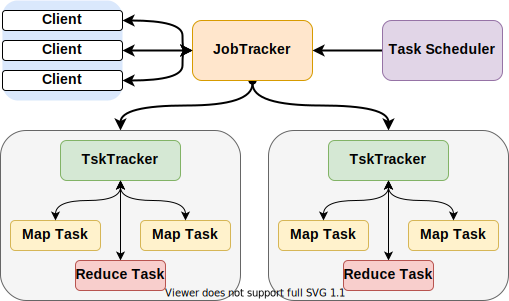

大数据与云计算

[目录](./00-目录.md)

## 第六章分布式并行框架 MapReduce
### 6.1 MapReduce 概述

> * 分布式并行编程: 借助一个集群通过多台机器同时并行处理大规模数据集
> * 相关的并行编程框架: MPI(消息传递接口,一种非常典型的并行编程框架)、OpenCL、CUDA

#### 6.1.1 并行编程模型和传统的并行编程框架区别

<table>
    <tr>
        <th></th>
        <th>集群的架构和容错性</th>
        <th>硬件价格及扩展性</th>
        <th>编程和学习难度</th>
        <th>适用场景</th>
    </tr>
    <tr>
        <td>传统并行编程框架</td>
        <td>
            1.性能计算模型 HPC,通常采用共享式框架(共享内存、共享底层的存储空间)底层都是采用统一的存储区域网络 SAN(共享底层的存储) 
            2.扩展比较难其中一个硬件发生故障以后容易导致整个集群不可工作
        </td>
        <td>采用刀片服务器,高速网络以及存储区域网络 SAN 共享式集群架构的扩展性比较差</td>
        <td>变成难度高:编程原理和多线程的编程逻辑比较类似,需借助很多的互斥量信号量锁等机制,要实现不同任务之间的同步</td>
        <td>用于实施的细粒度计算,尤其适用于计算密集型的应用</td>
    </tr>
    <tr>
        <td>MapReduce</td>
        <td>
            1.采用典型的非共享式架构 
            2.在整个集群中,每个节点都拥有自己的内存在任何一个节点出现问题,不会影响到其它节点正常运行,整个集群中又设计了冗余和容错机制
        </td>
        <td>整个集群中可以随意增加减少相关计算节点,不需要很高端的机器,而且扩展性好</td>
        <td>自动帮你你实现分布式部署,部署到集群上的各个机器上运行</td>
        <td>一般适用于非实时性的批处理以及<strong>数据密集型应用</strong></td>
    </tr>
</table>

#### 6.1.2 MapReduce 模型简介

* 策列:分而治之 —— 把非常庞大的数据集,切分成非常多的独立小分片,然后为每个分片单独地启动一个 Map 任务,最终通过多个 Map 任务,并行地在多个机器上去处理
* 理念:计算向数据靠拢 —— 将应用程序分发到数据所在地机器
> 数据向数据靠拢 --- 要完成一个数据分析时,选择一个计算节点,把运行数据分析地程序放到计算节点上运行,然后把它所涉及地数据,全部从各个不同节点上面拉过来,传输到计算发生的地方
* 架构:Master/slave架构——
    1. Master: 一个Master 服务器运行作业跟踪器 JobTracker ( 负责整个作业的调度和处理以及失败和恢复 )
    2. slave: 若干个 slave 服务器,负责具体任务执行的组件 TaskTracker ( 负责接收 JobTracker 给它发的作业处理指令,完成集体任务梳理 )

1. Map: 输入键值对<k1,v1>,将小数据进行进一步解析生成一批<key,value>对,输入 Map 函数进行处理,每一个输入<k1,v1>会得出一批<k2,v2>(中间计算结果)
2. Reduce: 输入中间计算结果<k2,List(v2)>中的 List(v2) 表示是一批属于同一个k2的value,输出<key.value>

### 6.2 MapReduce 的体系结构

1. Client(客户端)

    * 通过 Client 可以提交用户编写的应用程序,用户通过它将应用程序提交到 JobTracker 端
    * 通过这些 Client 用户也可通过它提供的一些接口去查看当前提交作业的运行状态

2. JobTracker(作业跟踪器)

    * 负责资源的监控和作业的调度
    * 监控底层的其它 TaskTracker 以及当前运行的 Job 的健康状况
    * 一旦探测到失败的情况就把这个任务转移到其他节点继续执行,跟踪任务执行进度和资源使用量

3. Task Scheduler(任务调度器)

    * 执行具体的相关任务,一般接收 JobTracker 发送过来的命令
    * 把一些自己的资源使用情况看,以及任务的运行进度通过心跳的方式,也就是 HearBeat 发送给 JobTracker

4. TaskTracker(工作服务器)

    > ### slot --- 资源调度单位
    > * Map类型slot: 分配给 Map  任务
    > * Reduce类型slot: 分配给 Reduce 任务
    >> 不同类型的 slot 不通用,2.0将改进
    > ### Task --- 任务
    > * Map 任务: 分配给 Map 函数
    > * Reduce 任务: 分配给 Reduce 函数

### 6.3.1 MapReduce 工作流程

> Map 分区的数量取决于 Reduce 的数量

#### 6.3.2 MapReduce 各个执行阶段

1. MapReduce 框架使用 **InputFormat** 模块做 Map 前的**预处理**(比如验证输入的格式是否符合输入定义);
    然后,将输入文件切分为逻辑上的多个Input**Split**,
        Input**Split** 是 MapReduce 对文件进行处理和运算的`输入单位`,
        只是一个逻辑概念,每个 InputSplit 并没有对文件进行实际切割,
        只是记录了要处理的数据的**位置**和**长度**。

2. 因为 InputSplit 是逻辑切分而非物理切分,
    所以还需通过 **RecordReader** 根据 InputSplit 中的信息来处理 InputSplit 中的具体记录,
    加载数据并转换为适合 Map 任务读取的键值对,输入给Map任务。

3. Map任务会根据用户自定义的映射规则,输出一系列的`<key,value>`作为中间结果。

4. 为了让 Reduce 可以**并行**处理 Map 的结果,需要对Map的输出进行一定的
    分区(partition)、排序(sort)、合并(combine)、归并(merge)等操作,
    得到`<key,value>`形式的中间结果,
    再交给对应的 Reduce 进行处理,这个过程称为 **shuffle(洗牌)**。
    从无序的`<key,value>`到有序的`<key,value-list>,`这个过程用 Shuffle 来称呼是非常形象的。

5. Reduce 以一系列`<key,value-list>`中间结果为输入,执行用户定义的逻辑,
    输出结果给**OutputFormat**模块。

5. OutpFormat 模块会验证输出目录是否已经存在以及输出结果类型是否符合配置文件中的配置类型,
    如果都满足,就输出 Reduce 的结果到分布式文件系统。

### 6.4 Shuffle

* 是指对 Map 输出结果进行分区、排序、合并等处理并交给Reduce的过程。
* 因此, Shuffle 过程分为 Map 端的操作和 Reduce 端的操作。

#### 6.4.1 Map 端的 Shuffle 过程

1. 数据分片
2. 运算结果写入缓存
3. 缓存达到阈值,溢写到磁盘文件 --- 溢写前会进行分区,分区内排序和合并(可选)
4. 归并成大文件
* 每次溢写会生成一个溢写文件,这些溢写文件最终需要被归并成一个大文件。
* 归并的意思:生成key和对应的value-list。
* 文件归并时,如果溢写文件数量超过参数min.num.spills.for.combine的值(默认为3)时,
   可以再次进行合并
> * 每个Map任务分配一个缓存
> * MapReduce默认100MB缓存
> * 设置溢写比例0.8
> * 分区默认采用哈希函数
> * 排序是默认的操作
> * 排序后可以合并（Combine）
> * 合并不能改变最终结果
> * 在Map任务全部结束之前进行归并
> * 归并得到一个大的文件，放在本地磁盘
> * 文件归并时,如果溢写文件数量大于预定值（默认是3）则可以再次启动Combiner,少于3不需要
> ##### 合并(Combine)和归并(Merge)的区别:
>   - 两个键值对<“a”,1>和<“a”,1>,如果合并,会得到<“a”,2>,
>   - 如果归并,会得到<“a”,<1,1>>

#### 6.4.2 Reduce 端的 Shuffle 过程

1. 领取数据
2. 归并数据
3. 数据输入给 Reduce 任务
* Reduce 任务通过 RPC(远程调用) 向 JobTracker 询问 Map 任务是否已经完成,若完成,则领取数据
* Reduce 领取数据先放入缓存,来自不同 Map 机器,先归并,再合并,写入磁盘
       多个溢写文件归并成一个或多个大文件,文件中的键值对是排序的
* 当数据很少时,不需要溢写到磁盘,直接在缓存中归并,然后输出给 Reduce

### 6.5 MapReduce 应用程序执行过程

### 6.6 实例分析:WordCount
#### 6.6.1 WordCount 程序任务

| 程序  | WordCount                  |
| :---: | :---:                      |
| 输入  | 一个包含大量单词的文本文件 |
| 输出  | 文件中每个单词及其出现次数(频树),并按照单词字母顺序排序,每个单词和其频数占一行,单词和频数之间有间隔 |

#### 6.6.2 WordCountd 设计思路

满足**分而治之**策略,可并行执行,汇总得出结果

#### 6.6.3 执行过程

### 6.7 MapReduce 具体应用

1. 关系代数运算(选则、投影、并、交、差、连接)
2. 矩阵运算
3. 分组聚合运算
4. 矩阵乘法

> #### MapReduce 自然连接
> * 雇员表R
>
> | Name    | Empld | DeptName |
> | ---     | ---   | ---      |
> | Harry   | 3415  | 财务     |
> | Sally   | 2241  | 销售     |
> | George  | 3401  | 财务     |
> | Harriet | 2202  | 销售     |
>
> * 部门表S
>
> | DeptName | Manager |
> | ---      | ---     |
> | 财务     | George  |
> | 销售     | Harriet |
> | 生产     | Charies |
>
> * 雇员 && 部门表
>
> | Name    | Empld | DeptName | Manager　｜
> | ---     | ---   | ---      | ---         |
> | Harry   | 3415  | 财务     | George      |
> | Sally   | 2241  | 销售     | Harriet     |
> | George  | 3401  | 财务     | George      |
> | Harriet | 2202  | 销售     | Harriet     |
>
> * 假设有关系 R(A,B) 和 S(B,C),对二者进行自然连接
> * 使用 Map 过程,把来自 R 的每个元组<a,b> 转换成一个键值对 `<b,<R,a>>` ,其中的键就是属性 B 的值。
> 把关系 R 包含到值中,这样做使得我们可以在 MapReduce 阶段,只把那些来自 R 的元组和来自 S 的元组进行匹配。
> 类似的,使用 Map 过程,把来自 S 的每个元组 <b,c>,转换成一个键值对 `<b,<S,c>>`
> * 所有具有相同 B 值的元组被发送到同一个 Reduce 进程中, Reduce进程的任务是,把来自关系 R 和 S 的,具有相同属性 B 值的元组进行合并。
> * Reduce 进程的输出则是连接后的元组<a,b,c>,输出被写到一个单独的输出文件中。

### 7.8 MapReduce 编程实践

1. 编写 Map 处理逻辑
2. 编写 Reduce 处理逻辑
3. 写 main 函数
4. 编译打包代码

[MapReduce实验](https://dblab.xmu.edu.cn/blog/2481-2/)
