大数据与云计算

## 第一章-大数据概述
1.1 大数据时代--2010年前后
* 第三次信息化浪潮--大数据+云计算+物联网

1.1.1 第三次信息化浪潮
> 根据IBM前首席执行官 **郭士纳** 的观点,IT领域每隔 **15年** 就会迎来一次重大变革

| 信息化浪潮 | 发生时间   | 标志                 | 解决问题 | 代表企业                                     |
| ---        | ---        | ---                  | ---      | ---                                          |
| 第一次     | 1980年前后 | 个人计算机           | 信息处理 | Inter\AMD\IBM\Apple\Microsoft\Lenovo\Dell\Hp |
| 第二次     | 1995年前后 | 互联网               | 信息传输 | Yahoo\Google\Alipay\Baidu\Tencent            |
| 第三次     | 2010年前后 | 互联网\云计算\大数据 | 信息爆炸 | 将涌现一批新的市场标杆                       |

1.1.2 信息科技为大数据时代提供技术支持
* **存储**+**计算**+**网络**

1.1.4 大数据发展历程
| 阶段       | 时间                   | 内容                                                                                                                                                                                                                                                                                     |
| ---        | ---                    | ---                                                                                                                                                                                                                                                                                      |
| 萌芽期     | 上世纪90年代至本世纪初 | 随着 **数据挖掘理论和数据库技术** 的逐步成熟,一批商业智能工具和知识管理技术开始被应用,如数据仓库,专家系统,知识管理系统等.                                                                                                                        |
| 成熟期     | 本世纪前十年           | Web2.0应用迅猛发展,非结构化数据大量产生,传统处理方法难以应对,带动了大数据技术的快速突破,大数据解决方案逐渐走向成熟,形成了 **并行计算与分布式系统两大核心技术** ,谷歌的GFS和MapReduce等大数据技术搜到追捧, **Hadoop** 平台开始大行其道 |
| 大规模应用 | 2010年前后             | 大数据应用参透各行各业,数据驱动决策,信息社会智能化程度大幅提高                                                                                                                                                                                                                           |

1.2 大数据概念
* Volume     大量化
* Velocity   快速化
* Variety    多样化
* Value      价值化
> 大数据不仅仅是数据的"大量化",而是包含"快速化"."多样化"和"价值化"等多重属性

1.2.1 数据量大
> 根据IDC作出的估测,数据一直都在以每年 **50%**  的速度增长,也就是说明每两年就增长一倍(大数据摩尔定律)
> 人类在最近两年产生的数据量相当于之前产生的全部数据量
> 预计2020年,全球将总共拥有35ZB,相较于2010年,数据量将增长30倍

==补充==
* 单位换算,标准进制1024,厂商进制1000
    - TB、PB、EB、ZB、YB、DB、NB

1.2.2 数据类型繁多
> 大数据是由 **结构化**  和 **非结构化**  组成的
>> - 10%的结构化数据,存储在数据库中
>> - 90%的非结构化数据,它们与人类信息有关-eg:基因组,Blog,图像

1.2.3 处理速度快
- [ ] 从数据的生成到消耗,时间窗口非常小,可用于生成决策的时间非常小
- [ ] 1秒定律:这一点也是和传统的数据挖掘技术有本质的不同

1.2.4 价值密度低,商业价值高

1.3 的数据的影响
> 图灵奖获得者,著名数据库专家Jim Gray博士观察并总结人类自古以来,在科学研究上,先后经历
> **实验**  , **理论**  , **计算**  和 **数据**  四种模式
> 在思维方式方面,大数据完全颠覆了传统的思维方式:
>> **全样而非抽样**
>> **效率而非精确**
>> **相关而非因果**

1.4 云计算典型应用
* 教务云,政务云,中小企业云,医疗云...

1.8.2 物联网IOT(International Of Things)
| 物联网架构 |
| :---:      |
| 感知层     |
| 网络层     |
| 处理层     |
| 应用层     |

1.8.3 大数据与云计算\物联网的关系
* **云计算** 解决分布式存储\计算
* **大数据** 处理分布式存储\计算
> * **大数据技术继承自云计算,**
> * **大数据时代为云计算提供用武之地,**
> * **物联网产生的数据存储于云计算,**
> * **数据又借助大数据进行分析**

## 第二章-大数据处理架构Hadoop
1.1 Hadoop
* Hadoop是Apache软件基金会旗下的一个 **开源分布式计算平台**  为用户提供了系统底层细节透明的 **分布式基础架构**
* Hadoop基于Java开发, **跨平台**
* Hadoop的核心是分布式文件系统 **HDFS** ( Hadoop Distributed File System ) 和 **MapReduce**
* Google\Yahoo\Cisco\Taobao 都支持 Hadoop

* 特征:
    - 高可靠性
    - 高效性
    - 高可扩展性
    - 高可容错性
    - 成本低
    - 运行在 Linux 平台上
    - 支持多种编程语言
---

---

2.2 Hadoop项目结构
---

| 组件      | 功能                                                                         |
| ---       | ---                                                                          |
| HDFS      | 分布式文件系统                                                               |
| MapReduce | 分布式并行编程模型                                                           |
| YARN      | 资源管理和调度器                                                             |
| Tez       | 运行在YARN上的下一代Hadoop查询处理系统                                       |
| Hive      | Hadoop上数据仓库                                                             |
| HBase     | Hadoop上的非关系型的分布式数据库                                             |
| Sqoop     | 用于Hadoop的大规模数据分析平台,提供类似SQL查询语言PigLatin                   |
| Oozie     | Hadoop上工作流管理系统                                                       |
| Zookeeper | 提供分布式协调一致性服务                                                     |
| Storm     | 流计算框架                                                                   |
| Flume     | 一个高可用的,高可靠的,分布式海量日志采集,聚合和传输的系统                    |
| Ambari    | Hadoop快捷部署工具,支持Apache Hadoop集群的供应,管理和监控                    |
| Kafka     | 一种高吞吐量的分布式发布订阅消息系统可以处理消费者规模网站中的所有动作流数据 |
| Spark     | 类似于Hadoop MapReduce的通用并行框架                                         |

---

2.3 [Hadoop](http://dblab.xmu.edu.cn/blog/install-hadoop/) 的安装与使用(单机/伪分布式)

2.4 Hadoop集群中有哪些重要节点类型
* Hadoop框架中最核心的是为海量数据提**存储**的**HDFS**和对数据进行**计算**的**MapReduce**

    - MapReduce的作业主要包括
    - [ ] 从硬盘或网络 **读取数据** , 即**IO密集工作**
    - [ ]  **计算数据**             , 即**CPU密集工作**

* Hadoop集群的整体性能取决于CPU,内存,网络及存储之间的 **性能平衡**
* Hadoop集群中的节点主要有:
    1. **NameNode**      : 负责协调集群中的数据存储             ( 名称节点,存放数据地址)
    2. **DateNode**      : 存储被拆分的数据块                   ( 数据节点,存放具体数据)
    3. **JobTracker**    : 协调数据计算任务                     ( 总管家)
    4. TaskTracker       : 负责执行JobTracker指派的任务
    5. SecondaryNameNode : 帮助NameNode收集文件系统运行状态信息 ( 冷备,作用于加速启动)
